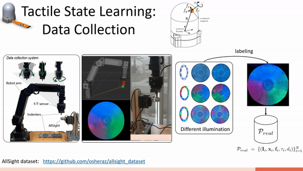

# **AllSight**-dataset

The AllSight dataset comprises of [AllSight](https://github.com/osheraz/allsight) contact interactions.
We believe that this dataset has the potential to contribute to advancements in tactile in-hand manipulations.

We provide access to AllSight images, contact pixels & poses, contact forces,
contact torques, and penetration depth.
This dataset is supplementary to the [AllSight paper](https://arxiv.org/abs/2307.02928) submission. 

<div align="center">
  
</div>

## Getting started: **Code**

## Folder structure
```bash
allsight_dataset
├── markers                                                   # gel type
    ├── rrrgggbbb          
    ├── white  
    ├── rgbrgbrgb                                             # led type
        ├── data             
            ├── sphere3                                       # object type
                ├── data_xx   
                    ├── data_xx_transformed_annotated.json    # gt labels
                    ├── summary.json                          # experiment summary
            ├── ...                                           
        ├── images                                            # RGB images  
            ├── sphere3
                ├── data_xx
                    ├── ref_image.png
                    ├── image_00.png
                    ├── ....png   
            ├── ...   
           
```


### Clone this dataset
```bash
git clone https://github.com/osheraz/allsight_dataset
cd allsight_dataset
```

## Usage

- [display_data.py](display_data.py): visualize dataset.
- [transform_data.py](transform_data.py): transformation pre-processing scripts.
- [annotate_data.py](annotate_data.py): annotations pre-processing scripts.
-
